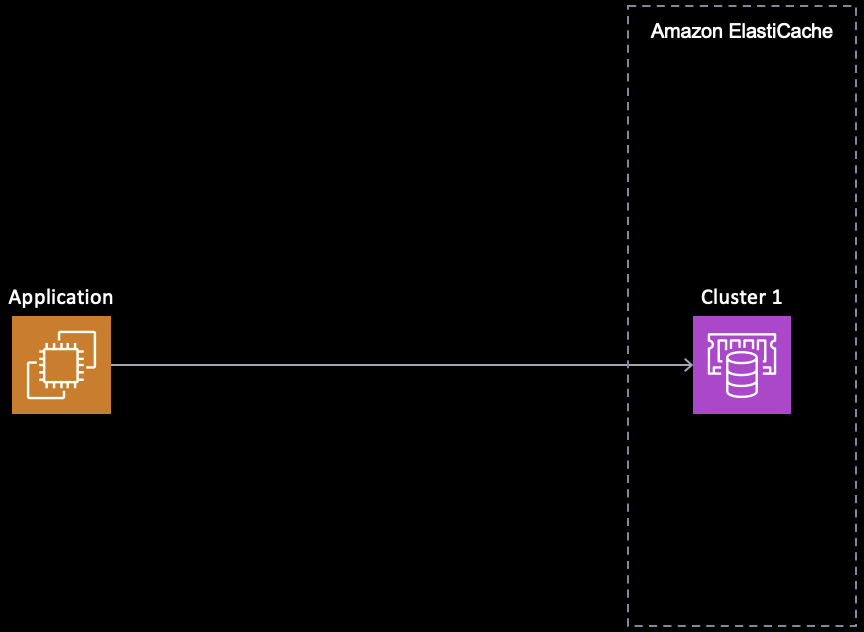
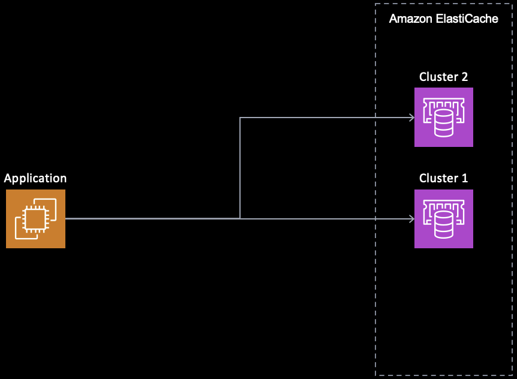
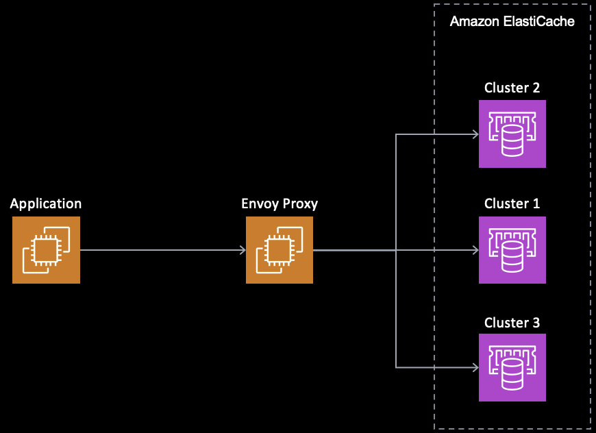

# envoy-migration

## Introduction

The [Envoy Proxy](https://www.envoyproxy.io/) is a wonderful utility that provides a laundry list of helpful communication approaches for common services.

For people who use [Valkey](https://valkey.io/) or Redis, they often face challenges when migrating data from one cluster to another.

One of the offerings of the Envoy Proxy is protocol that provides support for both Valkey and Redis and can be found [here](https://www.envoyproxy.io/docs/envoy/latest/intro/arch_overview/other_protocols/redis.html).

This repository will provide examples to demonstrate Envoy Proxy performing writes to multiple, different ElastiCache cluster types.

### Customer environment

This image shows an application accessing an existing cluster.

<div style="text-align: center;">
    
</div>

### Possible approach

What if you want to write to multiple clusters? This may be for migration purposes. This figure shows an application accessing multiple clusters. The challenge here is that the customer must now update their code to access two clusters.

The example below shows a customer trying to move from one ElastiCache cluster to either a new one or multiple new clusters.

<div style="text-align: center;">
    
</div>

### Envoy Approach

The example below shows a customer using a single connection to an Envoy proxy and it writes to 3 separate, differently configured clusters simultaneously.

<div style="text-align: center;">
    
</div>

## Getting started

### Create an EC2 security group

Create a security group called `Allow Envoy Proxy Access'. Give it a description.

Include the following inbound rules:

- port 22 for secure shell (you decide the source)
- port 9901 Envoy admin panel access (you decide the source)

### Create an EC2 system

This is an example EC2 system only. Your system selection will depend upon the performance requirements you have.

- Call it `envoy`
- Select Amazon Linux 2023 AMI.
- Select your appropriate key pair name.
- Select m5.large (or bigger) so you can run a Docker image at a reasonable speed.
- Apply the `Allow Envoy Proxy Access' security group to it.
- Give it at least 50GB of storage.
- Leave all other settings as they are.

### Update your ssh config file

If on linux or mac, update your `.ssh/config` file with something like this, changing the HostName to the public IP, and the IdentityFile to .pem key location:

```console
Host envoy
    HostName ec2-public-ip-here
    User ec2-user
    IdentityFile ~/.ssh/your-pem-key.pem
    ServerAliveInterval 50
```

### Connect to your EC2 system

Use SSH to connect to the newly created EC2 system.

### Setup the Valkey CLI utility

The Valkey CLI will allow us to connect to ElastiCache. The following commands will download Valkey and add it to your PATH variable.

```console
wget https://download.valkey.io/releases/valkey-7.2.5-focal-x86_64.tar.gz
tar xvzf valkey-7.2.5-focal-x86_64.tar.gz
rm valkey-7.2.5-focal-x86_64.tar.gz
mv valkey-7.2.5-focal-x86_64 valkey
echo "export PATH=\$PATH:$HOME/valkey/bin" >> ~/.bashrc
source ~/.bashrc
```

### Clone the Envoy examples repo:

From your EC2 system, clone the repository:

`git clone https://github.com/aws-samples/amazon-elasticache-samples.git`

Change directory to the repo:

`cd amazon-elasticache-samples`

### Install and setup Docker on the EC2 system

The following commands will install Docker, add your user to run Docker, and restart the docker daemon.

```console
sudo yum -y update
sudo yum -y install docker
sudo usermod -aG docker ${USER}
sudo systemctl start docker
```

Log out and then SSH back in to ensure the Docker group permissions were applied.

### Create another EC2 security group

- Call it 'Envoy ElastiCache Access'
- Allow port 6379 and 6380 for Valkey / Redis access (you decide the source)

Ensure you are selective in allowing the source IP addresses to connect to your clusters. ElastiCache is not accessible from the Internet; however, it is a good practice to only allow specific IP addresses or subnets to connect.

### Create the ElastiCache clusters you want to write to

**PLEASE NOTE** this next step is for demo purposes only. Any clusters you create will incur fees to your account in AWS. If you do create these clusters, ensure you delete them as soon as you are done testing.

Create 3 clusters.

All clusters should be created with these options:

  - Deployment option: Design your own cache
  - Creation method: Cluster cache
  - Cluster mode: enabled
  - Node type: cache.t4g.micro
  - Number of shards: 2
  - Replicas per shard: 1
  - Subnet Groups: Choose an existing subnet group
  - Security Groups: Envoy ElastiCache Access
  - Any settings not listed above and below should be left as default

In addition to the above, for simplicity's sake, you can use these specifics for individual clusters:

- Cluster 1:
  - name: cluster1
  - Encryption in transit: no
- Cluster 2:
  - name: cluster2
  - Encryption in transit: no
- Cluster 3:
  - name: cluster3
  - Encryption in transit: yes
  - Access control: Redis AUTH default user access
  - Redis AUTH token: (you decide this and store it somewhere safe)

### Wait for ElastiCache

You'll need to wait for ElastiCache clusters to provision because you'll need their endpoint names in the next step.

### Setup the yaml file

On the EC2 system, copy one of the example yaml files to `envoy.yaml` and modify it to suit your needs.

- [dual-write.yaml](dual-write.yaml) Writes to cluster1 and cluster2
- [triple-write.yaml](triple-write.yaml) Writes to cluster1, cluster2, cluster3

Cluster1 and Cluster2 assume no TLS and no password.

Cluster3 assumes TLS is enabled with a password.

Make sure to update the `address` field for each cluster. Search for, and change, `cluster1-endpoint`, `cluster2-endpoint`, and `cluster3-endpoint`.

Also make sure to update the password for cluster3. Search for, and replace, the `inline_string` value.

### On the EC2 system, download and test Envoy docker image

```console
docker pull envoyproxy/envoy:dev
docker run --rm envoyproxy/envoy:dev --version
```

### Create a log file directory

On your EC2 system:

```console
mkdir log
chmod 755 log
```

### Create a script to launch things

Execute the `envoy.sh` script:

```console
sh ./envoy.sh
```

Launching this script will:
- create the docker container for Envoy, and remove it once it's complete. If you do not want it to be removed each time, delete the line with `--rm \` in it.
- copy your customized `envoy.yaml` file into the docker container and use it.
- write to the `log/customer.log` file on your EC2 system so you can use `tail -F log/customer.log` to watch as things happen

### Execute Envoy

In one window, SSH into your EC2 system and start tailing the log file:

```console
tail -F log/customer.log
```

It may give a warning that it doesn't yet exist, but that is okay. It will still work.

In another window, start up Envoy:

```console
./envoy.sh
```

### Test the deployment

Wait until you see something like this in the log file: "all dependencies initialized. starting workers"

Now you can do a test:

```console
valkey-cli -h localhost -p 6379 SET a 1
```

Then connect to each cluster to ensure it was written. The below are only examples based on the assumptions above (TLS, password, etc.)

```console
valkey-cli -c -h cluster1-endpoint.cache.amazonaws.com GET a
```

```console
valkey-cli -c -h cluster2-endpoint.cache.amazonaws.com GET a
```

```console
valkey-cli --tls -c -h cluster3-endpoint.cache.amazonaws.com --user default -a your_redis_password GET a
```

All the examples should return `"1"`

### Push the system a little harder

Now try running the valkey-benchmark command to see if all systems can keep up:

```console
valkey-benchmark -p 6379 -n 10000 -r 10000 -d 10 -t get,set --csv
```

You can then check to see if any random key is on a cluster:

```console
valkey-cli -c -h cluster1-endpoint.cache.amazonaws.com GET key:000000036250
```

### Optionally use the envoy proxy admin panel

Get your public IP of the EC2 system, and point your browser to `http://your_external_ip:9901` to see the information available.

This guide does not provide instructions on how to secure the Envoy Proxy or the Envoy Proxy UI. Please ensure you apply appropriate safeguards and security measures.

### Clean Up

When you are done testing, make sure to delete the ElastiCache clusters you created for testing and the EC2 system you created. Even if they are not being actively used, they will incur charges to your AWS account.

You should also delete the security group that you created.
