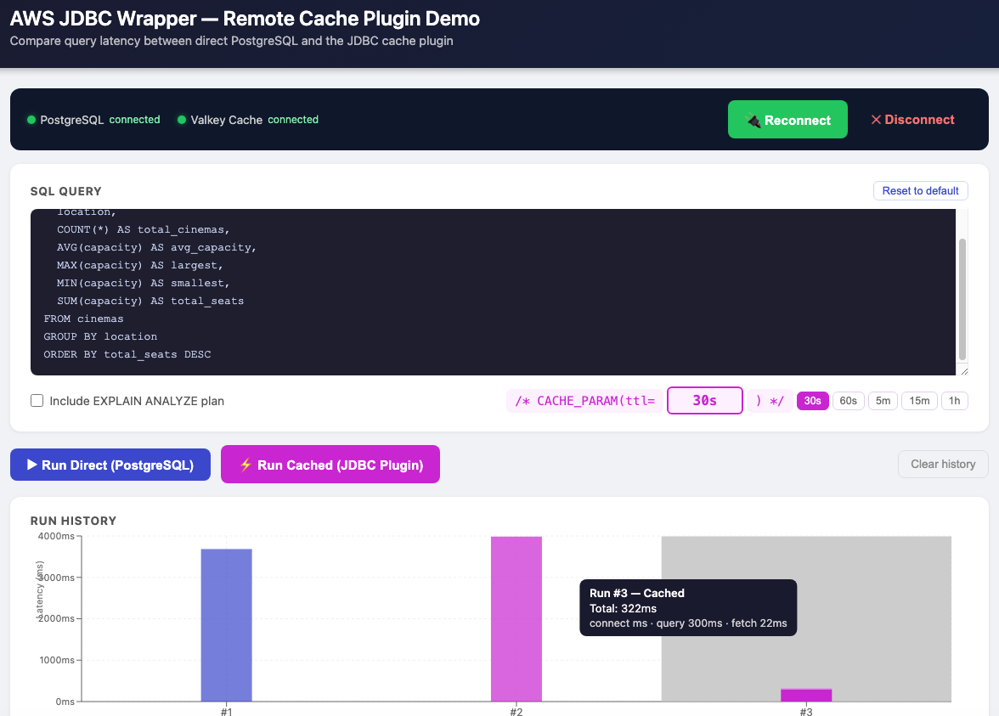
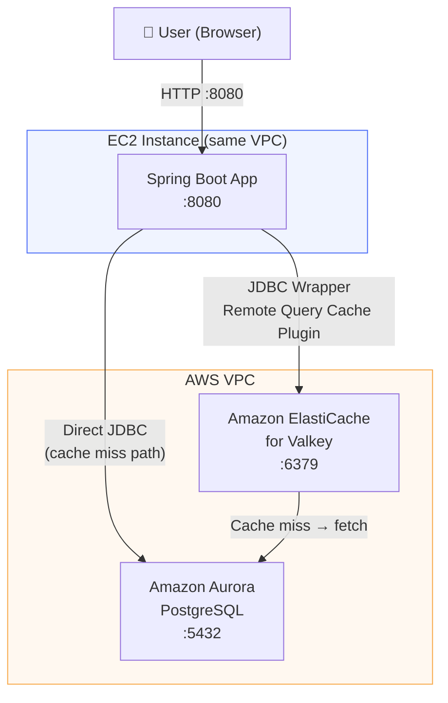

# JDBC Cache Plugin Demo App

An interactive web app that demonstrates the performance difference between querying Amazon Aurora PostgreSQL directly versus using the [AWS Advanced JDBC Wrapper Remote Query Cache Plugin](https://github.com/aws/aws-advanced-jdbc-wrapper/blob/main/docs/using-the-jdbc-driver/using-plugins/UsingTheRemoteQueryCachePlugin.md) with Amazon ElastiCache for Valkey.

---

## Screenshot



---

## Prerequisites

Before running this app, you need the following infrastructure in place:

- Amazon Aurora PostgreSQL cluster
- Amazon ElastiCache for Valkey cluster
- Both clusters must be in the same VPC as the EC2 instance you will deploy to
- EC2 instance with Java 17+ installed and port 8080 open in its security group
- For local development: SSH access to the EC2 instance (for tunneling)

---

## Identifying Cache Candidates

Not all queries benefit equally from caching. The ideal candidates do significant work (multi-table joins, aggregations, full scans) but return small result sets — expensive to execute, cheap to cache.

The three characteristics to look for: **high latency**, **high call frequency**, and **high work-to-result ratio**.

### Using Amazon RDS Performance Insights

Check Performance Insights in the AWS Console first. It surfaces top SQL queries by database load without writing any SQL. Look for:

- Queries with average latency > 100ms
- Queries called > 100 times per minute
- Read-only SELECT statements
- Queries accessing relatively static data (product catalogs, reference tables, user profiles)

### Finding candidates with SQL

Both PostgreSQL and MySQL expose query statistics you can query directly. PostgreSQL measures work in **shared buffer blocks** (8KB each); MySQL measures **rows examined**. The principle is the same: find queries that do 100x more work than the results they return.

**PostgreSQL — enable the extension first:**

```sql
CREATE EXTENSION IF NOT EXISTS pg_stat_statements;
```

**PostgreSQL query:**

```sql
SELECT
    LEFT(query, 80) AS query_preview,
    calls,
    ROUND(total_exec_time::numeric / calls, 2) AS avg_time_ms,
    ROUND((rows::numeric / calls), 0) AS avg_rows,
    ROUND(((shared_blks_hit + shared_blks_read)::numeric /
           NULLIF(rows, 0)), 0) AS blocks_per_row
FROM pg_stat_statements
WHERE query LIKE 'SELECT%'
  AND rows > 0
  AND (shared_blks_hit + shared_blks_read) / NULLIF(rows, 0) > 100
ORDER BY calls DESC, blocks_per_row DESC
LIMIT 20;
```

Key metrics: `calls` (frequency) and `blocks_per_row` (work per result row). A value of 100+ means the query scans 800KB+ of data per row returned.

**MySQL / Aurora MySQL query:**

```sql
SELECT
    LEFT(DIGEST_TEXT, 80) AS query_preview,
    COUNT_STAR AS calls,
    ROUND(AVG_TIMER_WAIT / 1000000000, 2) AS avg_time_ms,
    ROUND(SUM_ROWS_SENT / COUNT_STAR, 0) AS avg_rows_sent,
    ROUND(SUM_ROWS_EXAMINED / NULLIF(SUM_ROWS_SENT, 0), 0) AS rows_examined_per_sent
FROM performance_schema.events_statements_summary_by_digest
WHERE DIGEST_TEXT LIKE 'SELECT%'
  AND SUM_ROWS_SENT > 0
  AND (SUM_ROWS_EXAMINED / NULLIF(SUM_ROWS_SENT, 0)) > 100
ORDER BY COUNT_STAR DESC, rows_examined_per_sent DESC
LIMIT 20;
```

Key metrics: `calls` (frequency) and `rows_examined_per_sent` (rows scanned per row returned). A value of 100+ is a strong caching signal.

### The query used in this demo

The product catalog query in this app is a textbook caching candidate — it joins 5 tables, performs aggregation across potentially millions of review rows, and returns only 50 results. PostgreSQL analysis shows it scans **342 blocks per row returned** (2.7MB per row), runs **5,420 times per hour**, and takes **145ms on average**. With caching, subsequent identical queries return in single-digit milliseconds from Valkey.

## Architecture



**Request flow:**

| Path | Description |
|---|---|
| `GET /` | React SPA served as static resources |
| `GET /api/query/direct` | Plain JDBC → Aurora PostgreSQL |
| `GET /api/query/cached` | AWS JDBC Wrapper (remoteQueryCache plugin) → Valkey → Aurora (on miss) |

**Components:**

| Layer | Technology |
|---|---|
| Frontend | React 18, Vite, Recharts |
| Backend | Spring Boot 3.4, Java 17 |
| Database | Amazon Aurora PostgreSQL |
| Cache | Amazon ElastiCache for Valkey |
| JDBC Driver | AWS Advanced JDBC Wrapper 3.3.0 |

The backend holds persistent connections to both PostgreSQL and the cache plugin at startup (via the Connect button), so query latency measurements exclude connection overhead and reflect only execution time.

---

## Setting Up Test Data

The app queries a `cinemas` table. Use the included scripts to create it and load sample data.

**Quick start (10,000 rows, default):**

```bash
cd sample-app
./setup_cinemas.sh
```

**Custom row count:**

```bash
./setup_cinemas.sh 50000   # 50K rows
./setup_cinemas.sh 100000  # 100K rows
```

This connects to `localhost:5432` (assumes SSH tunnel is active), drops and recreates the `cinemas` table, then inserts the requested number of rows with randomized names, locations, and capacities.

**Run the SQL directly** (if you want to control the connection yourself):

```bash
PGPASSWORD=TempPassword12345 psql -h localhost -p 5432 -U dbadmin -d testdb \
  -c "SET my.rows = 50000;" -f setup_cinemas_table.sql
```

---

## Running Locally (SSH Tunnel)

Because Aurora and Valkey are inside a private VPC, local development requires SSH tunnels through the EC2 instance.

**Step 1 — Open tunnels:**

```bash
# Tunnel Aurora PostgreSQL (adjust host values to match your environment)
ssh -N -L 5432:<your-aurora-cluster-endpoint>:5432 ec2-user@<your-ec2-ip> &

# Tunnel Valkey
ssh -N -L 6379:<your-valkey-endpoint>:6379 ec2-user@<your-ec2-ip> &
```

**Step 2 — Configure local environment** (`sample-app/backend/.env`):

```env
DB_HOST=127.0.0.1
DB_PORT=5432
DB_NAME=mydb
DB_USER=dbadmin
DB_PASSWORD=your-db-password

CACHE_ENDPOINT=127.0.0.1:6379
CACHE_USE_SSL=false
```

**Step 3 — Start the app:**

```bash
./sample-app/run.sh
```

This installs frontend deps if needed, starts Spring Boot on `:8080`, waits for it to be healthy, then starts the Vite dev server on `:5173`.

Open `http://localhost:5173` in your browser.

---

## Deploying to EC2

Builds the jar locally, uploads to S3, and installs a systemd service on EC2:

```bash
./sample-app/deploy-to-ec2.sh
```

The app runs as `ec2-user` under systemd — it survives logout and auto-restarts on reboot.

**EC2 configuration** (`sample-app/backend/.env.ec2`) uses direct VPC endpoints (no tunnels needed):

```env
DB_HOST=<your-aurora-cluster-endpoint>
DB_PORT=5432
DB_NAME=mydb
DB_USER=dbadmin
DB_PASSWORD=your-db-password

CACHE_ENDPOINT=<your-valkey-endpoint>:6379
CACHE_USE_SSL=false
```

**Access the app:**

```
http://<EC2_PUBLIC_IP>:8080
```

---

## Using the App

1. Click **Connect** — initializes persistent connections to PostgreSQL and Valkey
2. Click **Run Direct (PostgreSQL)** — executes the product catalog query directly against Aurora
3. Click **Run Cached (JDBC Plugin)** — first run is a cache miss (slower), subsequent runs are cache hits (fast)
4. The bar chart shows latency for every run — click any bar to view its result set
5. Check **Include EXPLAIN ANALYZE plan** to see the query execution plan (collapsed by default)
6. Edit the SQL textarea to test with your own queries — the cache hint `/* CACHE_PARAM(ttl=300s) */` is prepended automatically for cached runs

---

## Managing the Service on EC2

```bash
# SSH into EC2
ssh ec2-user@<your-ec2-ip>

# Check status
sudo systemctl status sample-app

# View live logs
tail -f /home/ec2-user/sample-app/app.log

# Restart after a new deploy
sudo systemctl restart sample-app

# Stop
sudo systemctl stop sample-app
```

---

## Clean Up

**Stop locally:**

```bash
# Ctrl+C in the run.sh terminal, or:
pkill -f "sample-app.jar"
pkill -f "vite"
```

**Stop on EC2:**

```bash
ssh ec2-user@<your-ec2-ip> \
  "sudo systemctl stop sample-app && sudo systemctl disable sample-app"
```
