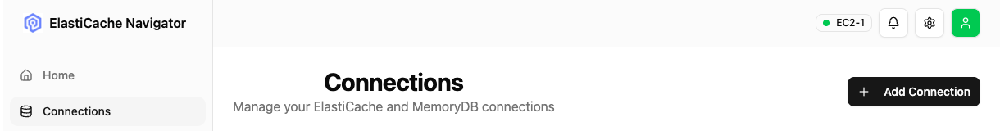

# Connections

To Help Topic:
- [**Overview**](README.md)
- [**Settings**](settings.md)
- **Connections**
- [**AI Agent Recommendation**](ai-agent-recommendation.md)

## On the connection page you can add or modify available connections to ElastiCache clusters

The following attributes can be set:
- **Name** - Readable name to identify your cluster in the connection list
- **Endpoint** - Endpoint of your cluster, just the hostname without the port. Note: in clusters this is the host name of the main node.
- **Port** - Port used at the endpoint. Note that often 6379 is for non-TLS and 6380 for TLS. This value can be overwritten after changing the TLS setting to connect to the correct port
- **TLS** - Setting for TLS enabled, disables
- **Use Cluster** - Check if ElasiCache is in Cluster or non-cluster mode

