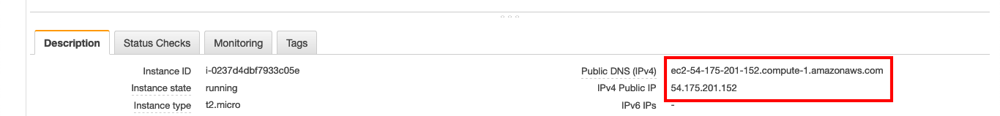
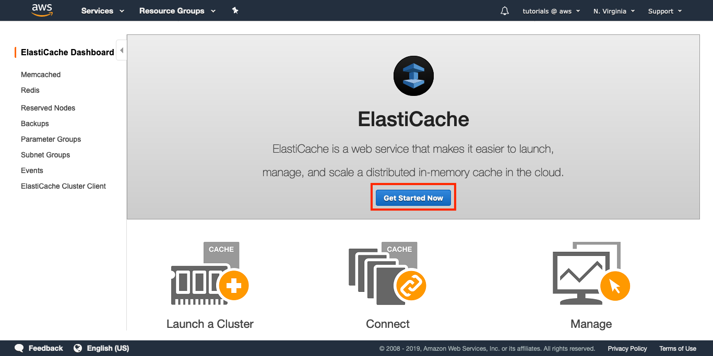
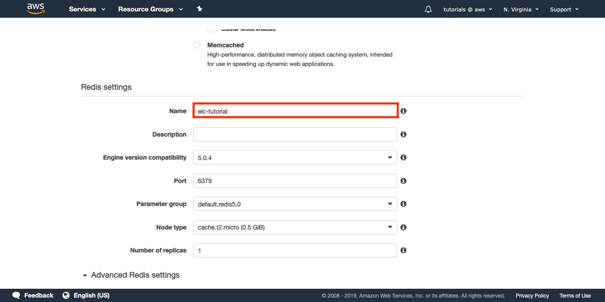
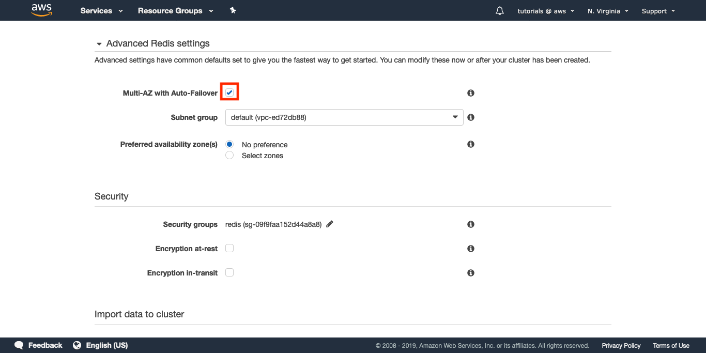
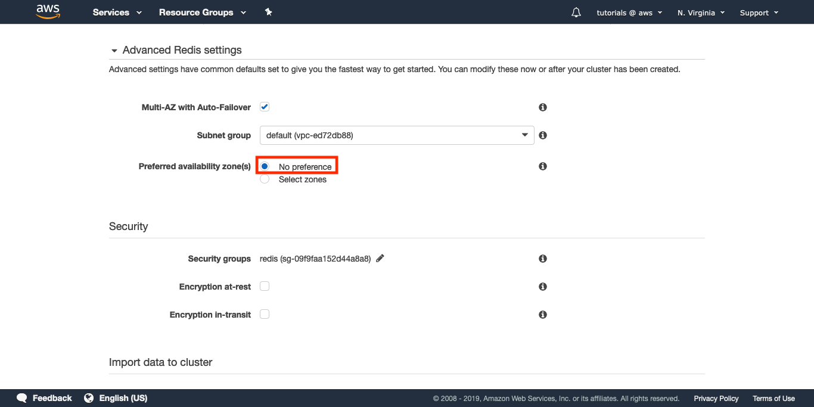
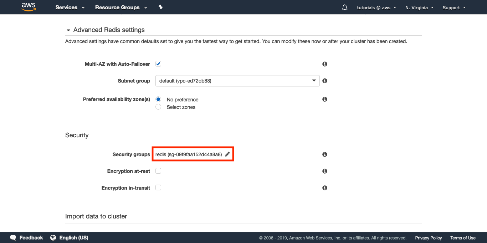
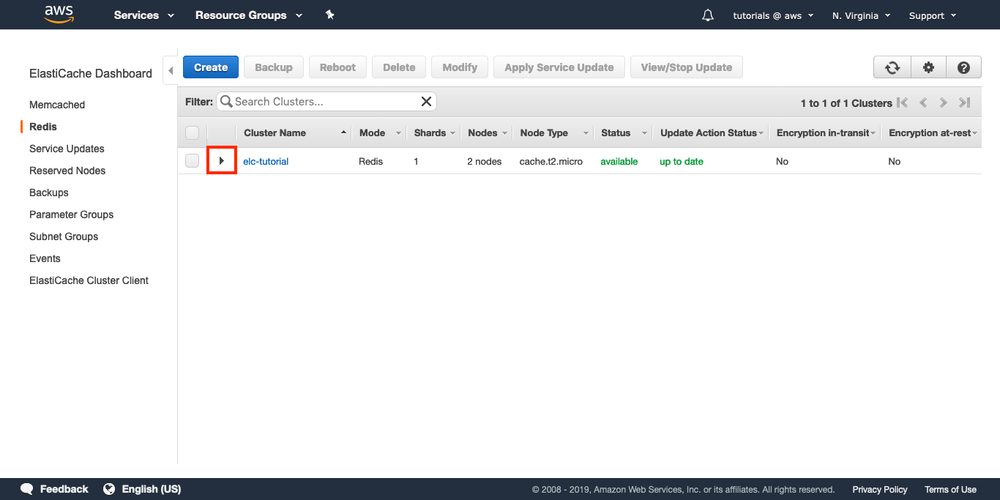
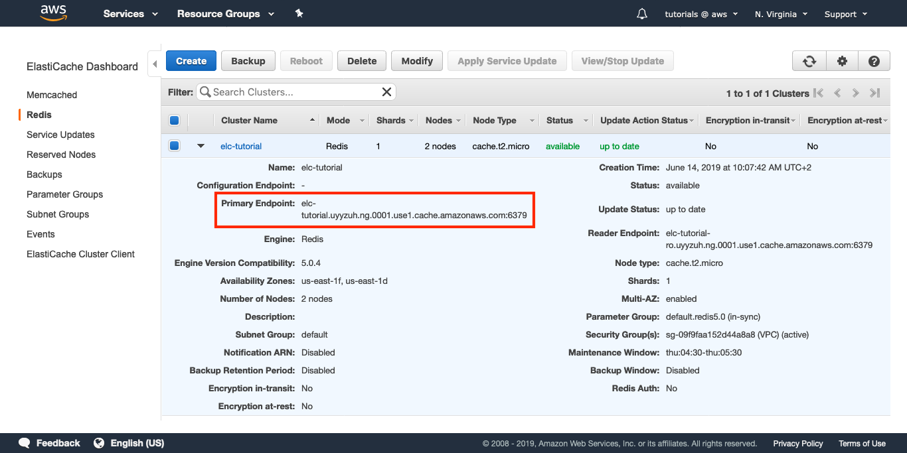
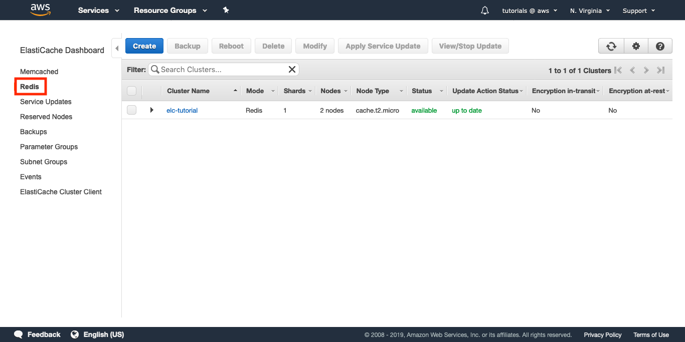
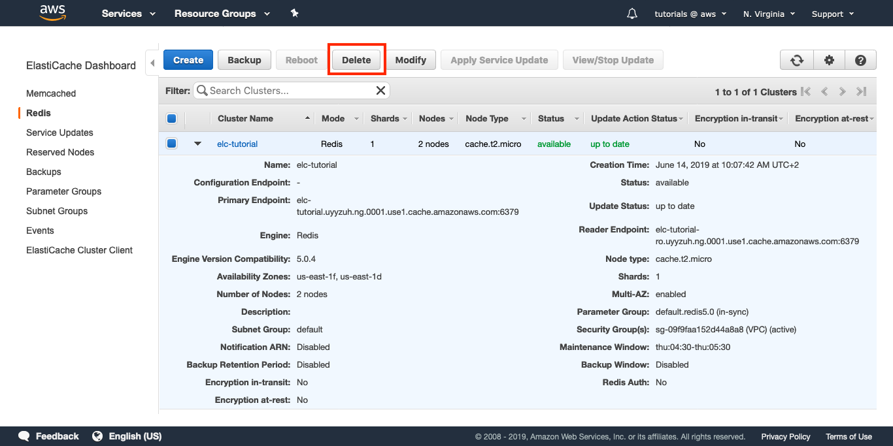

# ElastiCache for Redis (Online Lab)

**Building a fast session store for your online applications**

There are many ways of managing user sessions in web applications, ranging from cookies-only to distributed key/value databases, including server-local caching. Storing session data in the web server responding to a given request may seem convenient, as accessing the data incurs no network latency. The main drawback is that requests have to be routed carefully so that each user interacts with one server and one server only. Another drawback is that once a server goes down, all the session data is gone as well. A distributed, in-memory key/value database can solve both issues by paying the small price of a tiny network latency.  Storing all the session data in cookies is good enough most of the time; if you plan to store sensitive data, then using server-side sessions is preferable.

## Learning goal

In this tutorial you will learn how to use ElastiCache for Redis as a distributed cache for session management. You will also learn the best practices for configuring your ElastiCache nodes and how to handle the sessions from your application.

The ElastiCache node created in this tutorial is eligible for the [AWS free tier](https://aws.amazon.com/free/).

## Requirements

This tutorial illustrates some mechanisms with examples written in Python and the Flask microframework for web development. Hopefully the code will be easy to translate to your language of choice.

In order to complete this tutorial, you need access to an EC2 instance.  If you don't already have one running, follow [these instructions](https://docs.aws.amazon.com/efs/latest/ug/gs-step-one-create-ec2-resources.html) to provision one.

Make sure the security group of that instance allows incoming TCP connections on port 5000.

Once you have access to your EC2 instance, run the following commands:

**syntax: shell**

```console
$ sudo yum install git
$ sudo yum install python3
$ sudo pip3 install virtualenv
$ git clone https://github.com/aws-samples/amazon-elasticache-samples/
$ cd amazon-elasticache-samples/session-store
$ virtualenv venv
$ source ./venv/bin/activate
$ pip3 install -r requirements.txt
$ export FLASK_APP=example-1.py
$ export SECRET_KEY=some_secret_string
$ flask run -h 0.0.0.0 -p 5000 --reload
```

This will start a Flask application on port 5000. If the server doesn't report any errors, you should be able to visit the application from the command line in your EC2 instance with the following line:

**syntax: shell**

```console
$ curl http://127.0.0.1:5000/
```

It it works, you can now fetch the public IP address of your EC2 instance and try to access the web application from your computer.



In order to access the application from your browser, copy the Public DNS name of your EC2 instance and append the port number 5000. For example, given the address in the screenshot, the URL would be http://ec2-54-175-201-152.compute-1.amazonaws.com:5000/.

Now you are all set to start the tutorial.

# Step 1: Create a Redis Cluster

Open the [ElastiCache Dashboard](https://console.aws.amazon.com/elasticache/), then:

### 1.1 — On the top right corner, select the region where you want to launch your Redis Cluster.


### 1.2 — Click on "Get Started Now".



### 1.3 — Select "Redis" as your Cluster engine.


## Redis settings

### 1.4 — Choose a name for your Redis Cluster, e.g. "elc-tutorial".



### 1.5 — Change the Node type to cache.t2.micro.

That node type is fine for this tutorial, but for a production cluster the size of the node should depend on your workload and you should start with the m5 or r5 instance families.


### 1.6 — In Number of replicas, select 1.

That read-only replica will allow you to scale your reads. In case of a failure, an automatic failover will be triggered and the replica will take over the role of the master node.


## Advanced Redis settings

### 1.7 — Check the box for "Multi-AZ with Auto-Failover".



### 1.8 — Select a Subnet group.

If you need more information about Subnet groups, please refer to [the documentation](https://docs.aws.amazon.com/AmazonElastiCache/latest/red-ug/SubnetGroups.Creating.html).


### 1.9 — For Preferred availability zone(s), select "No preference".



Each node will be created in a different availability zone. This is a best practice for improved reliability.

## Configure the Security settings

For this example we won't use encryption, but keep in mind you can configure both encryption for data at-rest and for data in-transit.

### 1.10 — Select a Security group for your Redis Cluster.



This is important: make sure the Security group you select allows incoming TCP connections on port 6379 from your EC2 instance. If that's not the case, you won't be able to connect to your Redis nodes.

## Import data to cluster

For this example, we won't load any seed RDB file so we can skip this configuration step altogether. Just keep in mind that this option is available.

## Configure backups

Daily backups are important for most use cases, and a good recommendation is to enable backups with a retention period that will give you enough time to act in case anything bad happens. For this tutorial, we won't use any backups.

### 1.11 — Uncheck "Enable automatic backups".


## Maintenance settings

### 1.12 — Specify a maintenance window that suits your needs.

For this tutorial, it suffices to specify "No preference".


Here you can think about the time and day when your application has a low workload. For our current needs, we can just state "No preference".

## Review and create

After a quick review of all the fields in the form, you can hit "Create".

### 1.13 — Click on "Create".


A Redis Cluster will get initialized and once it becomes "available" you will be able to continue the next step.

# Step 2: Session caching with Redis

In order to understand the basic idea behind server-side session caching, you will implement a small application using [Flask](http://flask.pocoo.org/docs/1.0/), a microframework for web development in Python. As the focus will be on the concepts and not the particulars of a given framework and language, you can translate the examples to the web framework and programming language of your choice.

If you want to get started with Flask, follow the [installation instructions](http://flask.pocoo.org/docs/1.0/installation/#installation) and the [quickstart guide](http://flask.pocoo.org/docs/1.0/quickstart/#quickstart).

Below is a very basic application that lets you login and logout:

**syntax: python**

```python
import os
from flask import Flask, session, redirect, escape, request

app = Flask(__name__)
app.secret_key = os.environ.get('SECRET_KEY', default=None)

@app.route('/')

def index():

    if 'username' in session:
        return 'Logged in as %s' % escape(session['username'])

    return 'You are not logged in'

@app.route('/login', methods=['GET', 'POST'])

def login():

    if request.method == 'POST':

        session['username'] = request.form['username']
        return redirect('/')

    return '''
        <form method="post">
        <p><input type=text name=username>
        <p><input type=submit value=Login>
        </form>
    '''

@app.route('/logout')

def logout():

    session.pop('username', None)
    return redirect('/')
```

The rest of the examples will be based on this snippet. The code for all the examples can be found in [this repository](http://github.com/aws-samples/amazon-elasticache-samples/session-store).

If you have Flask installed and want to boot this app, copy the code to a file called example-1.py. Then you need to export two environment variables: FLASK_APP should be set to example-1.py, and SECRET_KEY should be set to a random string, for example Y0PJWblKsg1axM4fGW. If you need help setting up the environment variables, check Flask's [quickstart guide](http://flask.pocoo.org/docs/1.0/quickstart/#quickstart).

Once you are all set, run this command:

**syntax: shell**

```console
$ flask run -h 0.0.0.0 -p 5000 --reload
```

Then head to http://your_flask_endpoint:5000, where you should see your app running. You need to replace your_flask_endpoint with the Public DNS name of your EC2 instance, as you did in the Requirements.

There are three routes available: "/", "/login", and "/logout". Visit them all in turn and you will get familiar with the basic behavior.

## Basic behavior

The example uses a cookie to store a username. When you first visit the application, there's no username stored in the session object. When you go to "/login" and provide a username, the value is stored in a signed cookie and you get redirected to the homepage. Then, if you go to "/logout", the username is removed from the session and you are back where you started.

You will extend this basic application with server-side sessions, but first let's make sure you can connect to Redis.

## Test your connection to Redis

### 2.1 — Click on the arrow to display the Redis Cluster details.



### 2.2 — Copy the Primary Endpoint.



In the examples, each time a Redis endpoint is mentioned you should use the hostname of your Primary Endpoint.

### 2.3 — In your EC2 instance, configure the REDIS_URL environment variable.

**syntax: shell**

```console
$ export REDIS_URL="redis://your_redis_endpoint:6379"
```

### 2.4 — From your EC2 instance, enter the Python interactive interpreter:

**syntax: shell**

```console
$ python
```

### 2.5 — Now run these commands to test the connection to your Redis node.

**syntax: python**

```python
>>> import redis
>>> client = redis.Redis.from_url('redis://your_redis_endpoint:6379')
>>> client.ping()

**True**
```

If it hangs, it means you are being blocked by the Security Group settings. Verify that your EC2 instance has access to the security group assigned to your ElastiCache instance. For example, let's say your EC2 instance was assigned to the default security group. You can now modify the security group of your Amazon ElastiCache instance and add a Custom TCP rule allowing connections on port 6379 from any instance in the default security group:


In Source, you can start typing the name of the security group and you'll be able to click on the Security Group ID. If you need to learn more about Security Groups, you can check [the documentation](https://docs.aws.amazon.com/vpc/latest/userguide/VPC_SecurityGroups.html) or the [Security Group Rules Reference](https://docs.aws.amazon.com/AWSEC2/latest/UserGuide/security-group-rules-reference.html).

## Session caching with Redis hashes

Let's go back to the example. Now you will introduce some small changes that will allow you to store session data in Redis. Here's the second example with those changes:

**syntax: python**

```python
import os
import redis
from flask import Flask, session, redirect, escape, request

app = Flask(__name__)

app.secret_key = os.environ.get('SECRET_KEY', default=None)

# BEGIN NEW CODE - PART 1 #
REDIS_URL = os.environ.get('REDIS_URL')
store = redis.Redis.from_url(REDIS_URL)
# END NEW CODE - PART 1 #

@app.route('/')

def index():

    if 'username' in session:

        # BEGIN NEW CODE - PART 2 #
        username = escape(session['username'])
        visits = store.hincrby(username, 'visits', 1)

    return '''
        Logged in as {0}.<br>
        Visits: {1}
        '''.format(username, visits)
        # END NEW CODE - PART 2 #

    return 'You are not logged in'

@app.route('/login', methods=['GET', 'POST'])

def login():

    if request.method == 'POST':
        session['username'] = request.form['username']
        return redirect('/')

    return '''
        <form method="post">
        <p><input type=text name=username>
        <p><input type=submit value=Login>
        </form>'''

@app.route('/logout')

def logout():

    session.pop('username', None)
    return redirect('/')
```

Now Redis is imported and initialized, and index takes care of incrementing a counter and displaying it to the user.

Note that the Redis command you used for incrementing the counter is HINCRBY. That's because you are using a Redis hash for each user's session.

## Expire sessions

Now you will set a Time to Live (TTL) to the server side session. It's just one extra line of code, and this snippet will only include the / route.

**syntax: python**

```python
...
@app.route('/')

def index():

    if 'username' in session:

        username = escape(session['username'])
        visits = store.hincrby(username, 'visits', 1)
        # BEGIN NEW CODE #
        store.expire(username, 10)
        # END NEW CODE #

        return '''
            Logged in as {0}.<br>
            Visits: {1}
            '''.format(username, visits)

    return 'You are not logged in'
...
```

The key where the session is stored will expire in 10 seconds. It's a very short TTL, useful only for this example. If you run the application now, you will see how visiting the index updates the Visits counter, but if you let 10 seconds elapse without visiting that page, on the next refresh the counter will be back at 1.

## Real use cases and advanced examples

This short example is enough for learning the basics of server side sessions, but in a real world scenario you will do something different: instead of storing the username, you will generate and store a token once a user is authenticated. That token will represent be the Redis key under which all the server side session data will be stored. You may also want to abstract some of the behavior presented here, so that any access to the server side session refreshes the TTL without your intervention. In the repository, you will find an example that provides a [SessionStore](https://github.com/aws-samples/amazon-elasticache-samples/session-store/example-4.py) class that abstracts that behavior.

# Step 3: Cleanup

To finish this experiment, you will learn how to delete your Redis Cluster when it's not needed anymore.

## Delete your Redis Cluster

In order to delete your Redis Cluster, go to the [ElastiCache Dashboard](https://console.aws.amazon.com/elasticache/) and follow these instructions:

### 3.1 - Select "Redis" on the left pane.



This will show you a list of all your Redis clusters. 

### 3.2 — Select the Redis Cluster you created for this tutorial.


### 3.3 — Click on "Delete".



### 3.4 — You will be asked if you want to create a final backup.

That's usually a good idea, but it's not necessary for this tutorial. Select "No" and click on “Delete”.


The status of your cluster will change to "deleting".

# Congratulations!

You have learnt how to manage user sessions with a distributed key/value database. By leveraging on the Redis hash data type, you stored user data in an ElastiCache node and configured the session expiration mechanism.

# Next Steps

If you want to learn more about caching in AWS, read this [Caching Overview](https://aws.amazon.com/caching/) and make sure you check the documentation for [Session Management](https://aws.amazon.com/caching/session-management/). The code samples can be found in [this repository](https://github.com/aws-samples/amazon-elasticache-samples/session-store/).

| About this Tutorial  |                                                                           | 
| -------------------- | ------------------------------------------------------------------------- |
| Time                 | 120 minutes                                                               |
| Cost                 | Free Tier Eligible                                                        |
| Use Case             | Session Store, Scaling, High Availability, Real-time application          |
| Products             | Amazon ElastiCache for Redis, AWS Free Tier, Amazon EC2                   |
| Audience             | Developers                                                                |
| Level                | Beginner                                                                  |
| Last Updated         | July 25, 2019                                                             |

