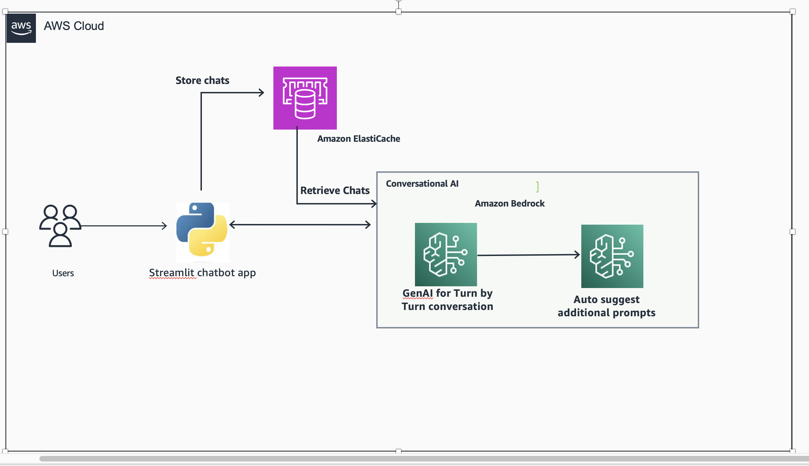
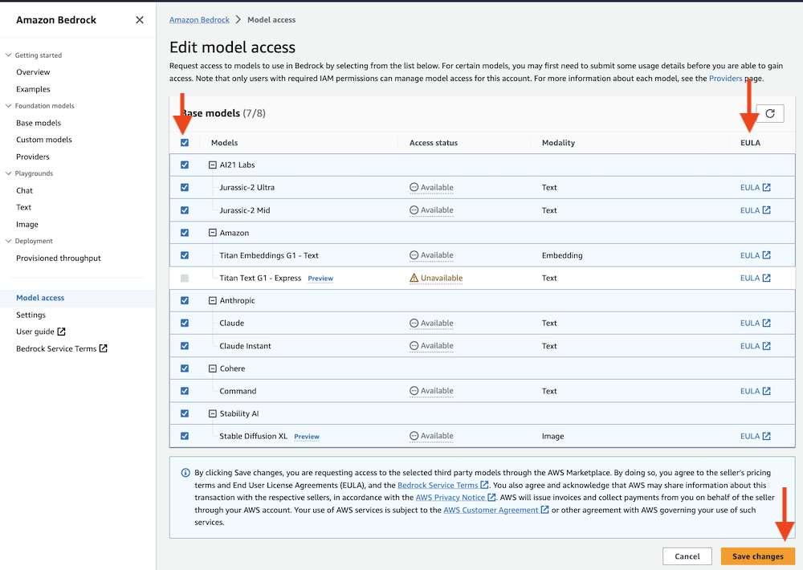

# Build a generative AI Virtual Assistant with [Amazon Bedrock](https://aws.amazon.com/bedrock/), [Langchain](https://github.com/langchain-ai/langchain) and [Amazon Elasticache](https://aws.amazon.com/elasticache/)

## Chatbot Application Deployment

This guide will walk you through the steps to deploy a Python chatbot application using [Streamlit](https://github.com/streamlit/streamlit) on [Cloud9](https://aws.amazon.com/cloud9/). This is the architecture we will be implementing today.



The application is contained in the `chatbot_app.py` file, and it requires specific packages listed in `requirements.txt`.

## Prerequisites

Before you proceed, make sure you have the following prerequisites in place:

1. An AWS Cloud9 development environment set up.
2. We will be using [Amazon Bedrock](https://aws.amazon.com/bedrock/) to access foundation models in this workshop.
3. Enable Foundation models such as Claude, as shown below:



4. Python and pip installed in your Cloud9 environment.
5. Internet connectivity to download packages.

## Installation

1. Clone this repository to your Cloud9 environment:

```bash
git clone [your-repo-url]
cd chatbot-app
```
   
2. Install the required packages using pip:

```bash
pip3 install -r ~/environment/workshop/setup/requirements.txt -U
```

3. Configure environment variables.


4. You can run the following commands to confirm:
(check [Amazon Bedrock endpoints and quotas](https://docs.aws.amazon.com/general/latest/gr/bedrock.html))

```bash
echo $BWB_ENDPOINT_URL
echo $BWB_PROFILE_NAME
echo $BWB_REGION_NAME
```


## Running the Application

```bash
streamlit run chatbot_app.py --server.port 8080
```   

