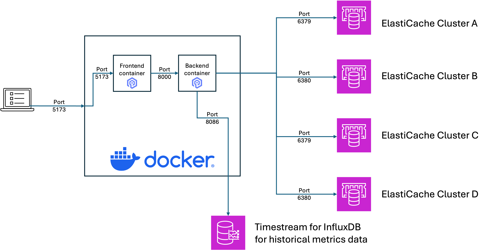
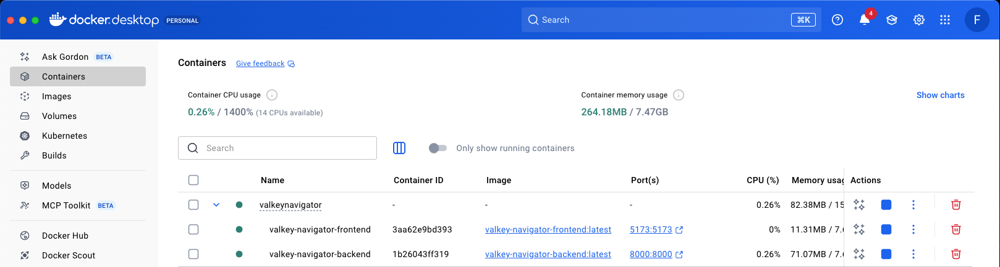

# ValkeyNavigator


ValkeyNavigator aims to address the need for unified observability and diagnostics capabilities in ElastiCache clusters running Valkey & Redis OSS. As customers migrate from Redis OSS to Valkey, we see a need for powerful yet simple tools to monitor, troubleshoot, and optimize cache performance with minimal operational overhead.

## Overview

This application contains of 3 parts
* Frontend - React application - UI for ValkeyNavigator
* Backend - Python application - All backend services
* Docker - Using docker composer and both frontend and backend are in its own Docker Files

## Architecture

The following diagram shows how components interacti:
- Browser connects to frontend hosted in Docker
- Frontend connects to backend also hosted in Docker
- Backend interacts with ElastiCache clusters according to function performed
- Optional: Historical metrics can be stored in Timestream for InfluxDB



Valkey Navigator is built as a Docker Application so it can be deployed in many environments. This includes local desktops, servers or other services like Amazon EKS. Here is how it looks like in a local Desktop environment:

Here is an example on how Valkey Navigator is deployed in Docker Desktop. Visible are the two containers for frontend and backend linked together as docker composer.




## How to install

For the first time after cloning, the following commands should be run in the `ValkeyNavigator` folder:

```
$ cd your_path/ValkeyNavigator
$ docker-compose build
$ docker-compose up
```

These commands can also be executed in the script `rebuild.sh` which contains the following shell commands that also removes old containers for recompilation:

```shell
#!/bin/sh
docker-compose down
docker image rm valkey-navigator-frontend
docker image rm valkey-navigator-backend
docker-compose build
docker-compose up
```

If you are running in Docker Desktop this will install all images and containers


If you modify some code afterwards, just run the following shell script from the `ValkeyNavigator` folder

```angular2html
$ cd your_path/ValkeyNavigator
$ sh rebuild.sh
```
This shell script contains the following lines:

```angular2html
#!/bin/sh
docker-compose down
docker image rm valkey-navigator-frontend
docker image rm valkey-navigator-backend
docker-compose build
docker-compose up
```

Once docker containers are started and you connect with the browser, the Valkey Navigator will have a Help & Documentation section online. 
You can also look at the following setup documentation here:

## [Application Setup Documentation](help/README.md)

Once docker containers are started and you connect with the browser, the Valkey Navigator will have a Help & Documentation section online.
You can also look at the following setup documentation with the link: [Application Setup Documentation](help/README.md)

## Known defects:
1. A browser can only connect to one UI. In case you have multiple Docker server (e.g.: One local on Docker Desktop, one on Docker installed in EC2 etc.) you need to use a different browser for each. Otherwise settings and connections are getting mixed up. Note: Each UI still can work with multiple ElastiCache connections.
2. InfluxDB creates field attributes types during first write to InfluxDB bucket. It has been observed that when using different ElastiCache clusters (e.g. serverless and provisioned), that metrics can have different types. If this is the case, the new records with different datatypes will be rejected. As a workaround for now, write these types of metrics into a different InfluxDB bucket 

--------------

## Authors and acknowledgment
- Norbert Funke
- Siva Karuturi

## License
For open source projects, say how it is licensed.

