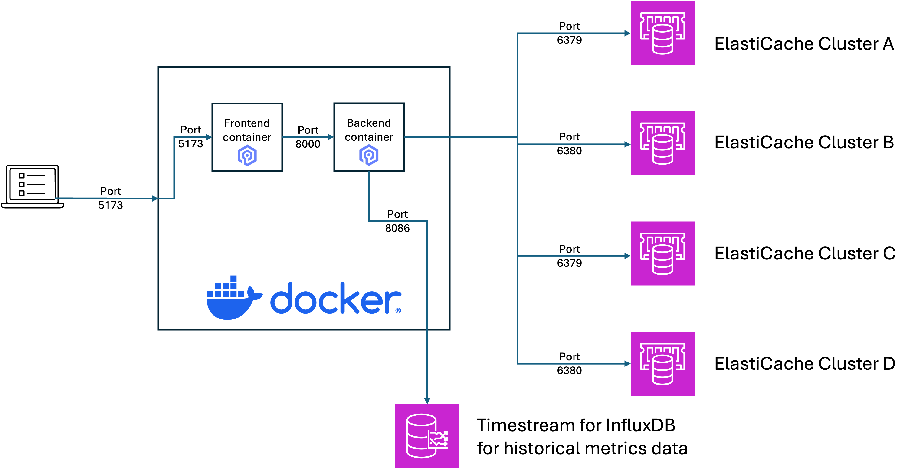
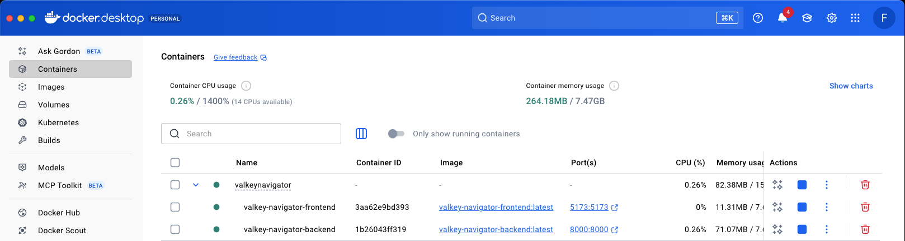

# Overview

Welcome to **ValkeyNavigator** Help & Documentation.

**ValkeyNavigator** is a unified observability tool that allows to interact with your Valkey clusters. While it is built for Valkey it also works for Redis OSS caches.

This section provides a quick overview of the app. Currently this guide contains instructions on how to configure Valkey Navigator App the first time you use it after successfully Docker installation
- [**Settings**](settings.md) - One time settings to allow Front-End Docker app to communicate with Back-End Docker app
- [**Connections**](connections.md) - Guide thru how to work with ElastiCache connections
- [**AI Agent Recommendation**](ai-agent-recommendation.md) - How to enable AI Recommendations

# Architecture

The following diagram shows how components interact:
- Browser connects to frontend hosted in Docker
- Frontend connects to backend also hosted in Docker
- Backend interacts with ElastiCache clusters according to function performed
- Optional: Historical metrics can be stored in Timestream for InfluxDB

Valkey Navigator is built as a Docker Application so it can be deployed in many environments. This includes local desktops, servers or other services like Amazon EKS. Here is how it looks like in a local Desktop environment:

Here is an example on how Valkey Navigator is deployed in Docker Desktop. Visible are the two containers for frontend and backend linked together as docker composer.

