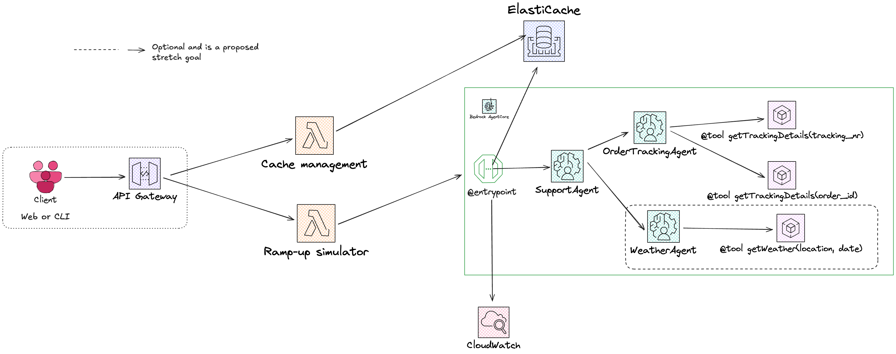

# Retail Support Desk - Semantic Caching Demo

An AI-powered retail customer support system demonstrating measurable cost and performance benefits through semantic caching with ElastiCache (Valkey), AWS Bedrock AgentCore, and multi-agent orchestration.

## 🎯 Project Goals

This application provides developers and AWS customers with a concrete, measurable demonstration of cost and performance benefits achievable through semantic caching in AI applications. The demo serves as a reference implementation showcasing how ElastiCache's vector search capabilities combined with Titan embeddings enable intelligent response caching in a modern multi-agent application deployed on Bedrock AgentCore.

**Key Demonstrations:**

- Handling request surges during peak sales events (e.g., Black Friday)
- Reducing response latency from seconds to milliseconds through semantic caching
- Cutting LLM token costs by avoiding redundant agent calls
- Multi-agent orchestration using AWS Bedrock AgentCore and Strands framework
- Real-time metrics visualization via CloudWatch Dashboard

## ✨ Key Features

- **Semantic Caching**: Uses Titan embeddings with HNSW algorithm (0.80 similarity threshold) to identify semantically similar requests
- **Multi-Agent Architecture**: SupportAgent orchestrates with OrderTrackingAgent using Strands framework
- **Intelligent Cache Layer**: @entrypoint intercepts requests before agent invocation, returning cached responses in <100ms
- **Agent Tooling**: OrderTrackingAgent uses decorated tools to check order status and delivery information
- **Real-time Metrics**: CloudWatch Dashboard visualizes latency reduction, cost savings, cache efficiency, and match scores
- **Traffic Simulation**: Lambda-based ramp-up simulator (1 → 11 requests/second over 180 seconds)
- **Conference-Ready**: Live metrics suitable for projection, optional cache reset between demos

## 🏗️ Architecture



### Data Flow

1. **Client** initiates request via **API Gateway** to **Ramp-up Simulator** (Lambda)
2. **Lambda** gradually increases throughput (1 → 11 requests/second over 180 seconds)
3. **@entrypoint** generates Titan embedding and queries **ElastiCache** vector index
4. **Cache Hit (≥0.80 similarity)**:
   - Returns cached response immediately (<100ms)
   - Logs metrics: latency, avoided cost, match score
5. **Cache Miss**:
   - Forwards to **SupportAgent** (Claude Sonnet 4.0)
   - **SupportAgent** analyzes request, consults **OrderTrackingAgent** if needed
   - **OrderTrackingAgent** uses `@tool` decorated functions to check order status
   - Response returned to **@entrypoint**, cached with embedding
6. **CloudWatch** receives metrics for all requests (cache hits/misses, latency, costs)
7. **Dashboard** visualizes cumulative effectiveness in real-time

## 🚀 Quick Start

### Prerequisites

**AWS Account Requirements:**
- AWS Account with Bedrock model access enabled:
  - Claude Sonnet 4 (`anthropic.claude-sonnet-4-20250514`)
  - Claude 3.5 Haiku (`anthropic.claude-3-5-haiku-20241022`)
  - Nova Embeddings (`amazon.nova-embed-text-v1:0`)
- IAM permissions to create: Lambda, ElastiCache, CloudWatch, CodeBuild, ECR, IAM roles

**Required Tools:**

| Tool | Version | Install Command | Verify |
|------|---------|-----------------|--------|
| AWS CLI | 2.x | [Install Guide](https://docs.aws.amazon.com/cli/latest/userguide/getting-started-install.html) | `aws --version` |
| Node.js | 18+ | [nodejs.org](https://nodejs.org/) | `node --version` |
| Python | 3.12+ | [python.org](https://www.python.org/) | `python3 --version` |
| Go | 1.21+ | [go.dev](https://go.dev/dl/) (for Lambda builds) | `go version` |

**AWS CLI Configuration:**

```bash
# Configure credentials (if not already done)
aws configure --profile semantic-cache-demo

# Set as default for this session
export AWS_PROFILE=semantic-cache-demo
export AWS_REGION=us-east-2
```

### Running the Application

1. **Clone the repository**

```bash
git clone https://github.com/vasigorc/valkey-semantic-cache-demo.git
cd valkey-semantic-cache-demo
```

2. **Deploy all infrastructure (single command)**

```bash
# Deploy all 7 stacks + create index + deploy agent
./deploy.sh --all

# Or deploy infrastructure only (then manually deploy agent)
./deploy.sh
./scripts/trigger-agent-deploy.sh
```

3. **Trigger simulation**

```bash
aws lambda invoke \
  --function-name semantic-cache-demo-ramp-up-simulator \
  --region us-east-2 \
  --payload '{}' \
  response.json
```

4. **View metrics**

   Navigate to CloudWatch Dashboard in AWS Console to observe:

   - Average latency reduction
   - Bedrock cost savings
   - Cache hit ratio
   - Match score distribution

### Resetting the Demo

For conference presentations, reset the cache between runs via the cache management Lambda:

```bash
# Via AWS CLI
aws lambda invoke \
  --function-name semantic-cache-demo-cache-management \
  --region us-east-2 \
  --payload '{"action": "reset-cache"}' \
  response.json && cat response.json

# Or via AWS Console: Test tab with payload {"action": "reset-cache"}
```

Other cache management actions:

```bash
# Health check (verify connectivity, dbsize, index status)
aws lambda invoke \
  --function-name semantic-cache-demo-cache-management \
  --region us-east-2 \
  --payload '{"action": "health-check"}' \
  response.json && cat response.json

# Create index (if needed after full cache flush)
aws lambda invoke \
  --function-name semantic-cache-demo-cache-management \
  --region us-east-2 \
  --payload '{"action": "create-index"}' \
  response.json && cat response.json
```

## 🛠️ Tech Stack

### Core Infrastructure

- **AWS Bedrock AgentCore**: Multi-agent runtime with Strands framework
- **AWS Lambda**: Serverless compute for simulation and cache management
- **API Gateway**: HTTP endpoint for client requests
- **ElastiCache (Valkey)**: Vector database with HNSW indexing
- **CloudWatch**: Metrics aggregation and dashboard visualization

### AI Components

- **Claude Sonnet 4**: Primary SupportAgent for complex query analysis
- **Claude 3.5 Haiku**: OrderTrackingAgent for fast tool invocations
- **Titan Embeddings**: Generate 1024-dimensional vectors for semantic search
- **Strands Framework**: Agent orchestration, @entrypoint and @tool decorators

### Development

- **Python 3.12+**: Primary language for Strands agents
- **Conventional Commits**: Git commit message format
- **CloudFormation/SAM**: Infrastructure as Code (when applicable)

## 📊 Data Structure

### Vector Index (Semantic Search)

```
Index Name: idx:requests
Key Pattern: request:vector:{uuid}
Fields:
  - request_id (TAG)
  - embedding (VECTOR HNSW, 1536 dimensions)
  - timestamp (NUMERIC)
```

### Request-Response Store

```
Key: rr:{request_id}
Hash:
  - request_text (string)
  - response_text (string)
  - tokens_input (numeric)
  - tokens_output (numeric)
  - cost_dollars (numeric)
  - created_at (timestamp)
  - agent_chain (string) # e.g., "SupportAgent->OrderTrackingAgent"
```

### Metrics Store

```
Key: metrics:global
Hash:
  - total_requests (numeric)
  - cache_hits (numeric)
  - cache_misses (numeric)
  - total_cost_savings_dollars (numeric)
  - avg_hit_proximity_match_score (numeric)
  - avg_latency_cached_ms (numeric)
  - avg_latency_uncached_ms (numeric)
```

## 🗺️ Project Timeline

### Task 1: Foundation

- [x] AWS account setup and Bedrock access verification
- [x] IAM role configuration (Lambda, Bedrock, ElastiCache, CloudWatch)
- [x] Repository structure and collaboration workflow
- [x] Architecture document and technical narrative

### Task 2: ElastiCache Integration

- [x] ElastiCache (Valkey) cluster provisioning
- [x] Vector index schema creation (HNSW, 1024 dimensions)
- [x] @entrypoint implementation in AgentCore
- [x] Titan Embeddings integration for semantic search
- [x] Basic cache hit/miss logic

### Task 3: SupportAgent Integration

- [x] SupportAgent deployment on AgentCore
- [x] System prompt design for retail support context
- [x] Integration with @entrypoint for cache misses
- [x] End-to-end test: cache miss → SupportAgent → cache write

### Task 4: CloudWatch Integration

- [x] Metrics emission from @entrypoint (latency, cost, hit ratio)
- [x] CloudWatch custom metric definitions
- [x] Dashboard creation with real-time visualization
- [x] VPC endpoint for CloudWatch Monitoring service
- [ ] Alerts configuration (optional)

### Task 5: Multi-Agent Scenario

- [x] OrderTrackingAgent deployment (Claude 3.5 Haiku)
- [x] @tool decorator implementation for order status checks
- [x] Agent orchestration: SupportAgent → OrderTrackingAgent
- [x] Tool invocation testing and validation
- [x] Token accumulation from sub-agent calls

### Task 6: Integration & Testing

- [x] End-to-end flow validation
- [x] Error handling (rate limits, model availability)
- [x] Local and AWS deployment testing
- [x] Performance optimization
- [x] Seed data creation (sample requests)

### Task 7: Simulation & Presentation Layer

- [x] Ramp-up Lambda implementation (1 → 11 requests/second over 180s)
- [x] Go-based Lambda with deterministic question selection
- [x] S3-based seed questions (50 base scenarios + 450 variations)
- [x] SAM template with IAM policies for deployment
- [x] Rate limiting and session pooling for AgentCore stability
- [x] CloudWatch Logs integration for monitoring
- [ ] API Gateway configuration (optional - direct Lambda invocation works)
- [ ] Cache reset Lambda (optional - manual flush via redis-cli)
- [ ] Demo script and walkthrough

### Task 8: Dashboard Enhancements

- [x] Add Cost Reduction % single-value widget (expression-based)
- [x] Add Pie Chart for Cache Hits vs Misses distribution
- [x] Remove Similarity Score Distribution widget (not a clear KPI)
- [x] Reorganize layout for business impact (top row: key KPIs)
- [x] Deploy and validate updated dashboard

### Task 9: Cache Management Lambda (Eliminate EC2 for Cache Ops)

- [x] Create separate Python Lambda (`cache_management/`) with valkey-glide-sync
- [x] Implement `health-check` action (ping, DBSIZE, FT.\_LIST)
- [x] Implement `reset-cache` action (SCAN + DEL for cached keys)
- [x] Implement `create-index` action (FT.CREATE with HNSW)
- [x] SAM template with VPC config for ElastiCache access
- [x] Deploy and test all actions

### Task 10: AgentCore Deployment Automation

- [x] CodeBuild automation for AgentCore deployment (eliminates EC2 jump host)
- [x] Master `deploy.sh` script - single command to deploy all 7 stacks
- [x] Master `teardown.sh` script - single command to delete all stacks

### Task 11: Simple Demo UI

- [x] Create Metrics API Lambda (queries CloudWatch, returns JSON)
- [x] Create API Gateway (POST /start, POST /reset, GET /metrics)
- [x] Create static HTML/JS page (Start, Reset buttons, 4 KPI cards)
- [x] Add polling/auto-refresh logic (every 5s during demo)
- [x] Style for conference projection (large fonts, high contrast)
- [ ] Deploy frontend to S3 + CloudFront (or serve from Lambda)

### Task 12: Demo Script Simplification

- [x] Create 5-minute script outline (Problem → Solution → Live Demo → Results)
- [x] Prepare business impact talking points (cost savings, latency reduction)
- [ ] Record fallback demo video (3-minute backup recording)
- [ ] Create simplified slides (3-4 slides, optional)
- [ ] Practice run with timing (ensure < 5 minutes)
- [x] Update SCRIPT.md with new simplified version

### Task 13: Multi-Runtime Scaling (Optional)

- [ ] Deploy second AgentCore runtime for increased throughput
- [ ] Configure Application Load Balancer (ALB) for WebSocket support
- [ ] Update ramp-up simulator to target ALB endpoint
- [ ] Test combined 50 TPS capacity (25 TPS × 2 runtimes)
- [ ] Document multi-AZ deployment pattern

## 🎪 Conference Demo Flow

1. **Fresh Start**: Show CloudWatch Dashboard (all metrics at zero)
2. **Ramp-up Simulation**: Invoke Lambda via AWS Console or CLI
   - Linear ramp: 1 → 11 req/s over 180 seconds (~1,080 total requests)
   - First 90s: Base questions prime the cache
   - Second 90s: Variations hit cache (80%+ hit rate)
3. **Live Metrics**: CloudWatch Dashboard shows real-time results
   - Cache hit ratio: 45% → 90% in 1 minute
   - Average cache hit latency: ~90ms (vs. 2-3s for full agent chain)
   - Cost savings: ~$2.33 per 30 minutes of traffic
   - Total cache hits: 600+ requests served from cache
4. **Key Takeaway**: Semantic caching enables handling traffic surges (Black Friday) with:
   - 20-30x latency reduction
   - Significant cost savings by avoiding redundant LLM calls
   - 90% cache efficiency for similar customer queries

## 📝 Configuration

### Environment Variables

**AgentCore / Lambda**

```env
AWS_REGION=us-east-1
ELASTICACHE_ENDPOINT=your-cluster.cache.amazonaws.com:6379
BEDROCK_SUPPORT_AGENT_MODEL=anthropic.claude-sonnet-4-20250514
BEDROCK_TRACKING_AGENT_MODEL=anthropic.claude-sonnet-3-5-v2
EMBEDDING_MODEL=amazon.nova-embed-text-v1:0
SIMILARITY_THRESHOLD=0.80
CLOUDWATCH_NAMESPACE=SemanticSupportDesk
```

**Simulation Parameters**

```env
RAMP_START_RPS=1
RAMP_END_RPS=11
RAMP_DURATION_SECONDS=180
REQUEST_TEMPLATES_PATH=./templates/requests.json
```

## 🤝 Development Principles

- **Incremental Progress**: Small, testable steps with frequent Git commits
- **Conventional Commits**: Structured commit messages (feat:, fix:, docs:)
- **Red → Green → Refactor**: TDD approach for cacheable business logic
- **Error Handling First**: No silent failures, comprehensive logging
- **Progress Tracking**: Maintained via `Progress.md` at repository root
- **Immediate Error Resolution**: Stop and fix blockers before proceeding

## 📦 Project Structure

```
valkey-semantic-cache-demo/
├── README.md
├── Progress.md
├── semantic_support_desk_arch.png  # Architecture diagram
├── agents/
│   ├── support_agent.py            # Main SupportAgent
│   ├── order_tracking_agent.py     # OrderTrackingAgent with @tool decorators
│   └── entrypoint.py               # @entrypoint with caching logic
├── lambda/
│   ├── ramp_up_simulator/          # Traffic simulation Lambda (Go)
│   ├── cache_management/           # Cache management Lambda (Python)
│   └── demo_ui_api/                # Demo UI API Lambda (Python)
├── infrastructure/
│   ├── cloudformation/             # Infrastructure as Code
│   └── elasticache_config/         # Valkey cluster configuration
├── templates/
│   └── requests.json               # Sample request templates for simulation
├── scripts/
│   ├── deploy.sh                   # Deployment automation
│   └── reset-demo.sh               # Demo reset script
└── tests/
    └─ unit/                       # Unit tests for agents
```

## 🐛 Troubleshooting

### ElastiCache Connection Fails

- Verify VPC security groups allow traffic from Lambda
- Check ElastiCache cluster status in AWS Console
- Review Lambda CloudWatch logs for connection errors

### AgentCore Agent Invocation Errors

- Confirm Bedrock model access in IAM permissions
- Verify model IDs match available Bedrock models in region
- Check Lambda timeout settings (increase if needed for agent chains)

### Metrics Not Appearing in CloudWatch

- Ensure CloudWatch PutMetricData permissions in Lambda role
- Verify custom namespace matches Dashboard configuration
- Check for rate limiting on CloudWatch API calls

### Cache Hit Ratio Lower Than Expected

- Review similarity threshold (may need adjustment < 0.85)
- Examine request diversity in simulation templates
- Verify embeddings are being generated correctly

### Throughput Limits

The demo is constrained by several AWS service limits:

| Factor                               | Limit                      | Impact                                                      |
| ------------------------------------ | -------------------------- | ----------------------------------------------------------- |
| **AgentCore InvokeAgentRuntime TPS** | 25 TPS per agent           | Primary bottleneck - max 25 concurrent requests             |
| **AgentCore Active Sessions**        | 500 concurrent (us-east-2) | Sessions idle for 15 min; requires session pooling          |
| **AgentCore New Session Rate**       | 100 TPM per endpoint       | Limits new session creation speed                           |
| **Cache Miss Latency**               | ~5-10 seconds              | Slow agent responses during cache priming create backlog    |
| **AWS SDK Rate Limiter**             | Built-in retry quota       | `failed to get rate limit token` when SDK limiter exhausted |

**Effective throughput**: ~5-6 RPS (~330 requests/min) due to these constraints. All limits are adjustable via AWS Service Quotas.
