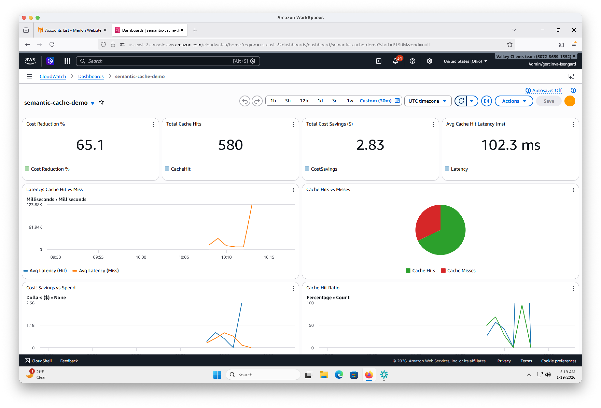

# Local Development Guide

This guide covers running the semantic cache demo locally for development and testing.

## Prerequisites

- Python 3.12+
- [uv](https://github.com/astral-sh/uv) package manager
- Go 1.21+ (for ramp-up simulator)
- AWS CLI configured
- Docker/Finch/Podman (for Valkey container)

## 1. Start Local Valkey

Run a Valkey container with vector search support:

```bash
docker run -d --name valkey -p 6379:6379 valkey/valkey-bundle:latest
```

## 2. Create Vector Index

The semantic cache requires a vector index for similarity search:

```bash
cd agents
source .venv/bin/activate
uv run python ../infrastructure/elasticache_config/create_vector_index.py
```

This creates the `idx:requests` index with:

- 1024 dimensions (Titan Embed Text v2)
- COSINE distance metric
- HNSW algorithm (M=16, EF_CONSTRUCTION=200)

## 3. Deploy CloudWatch Dashboard

The only AWS infrastructure needed for local development is the CloudWatch dashboard:

```bash
./scripts/deploy-cloudwatch-dashboard.sh
```

To tear down when done:

```bash
./scripts/teardown-cloudwatch-dashboard.sh
```

## 4. Configure AWS Credentials

Ensure your AWS profile has permissions for:

- `bedrock:InvokeModel` (Titan Embeddings, Claude/Nova models)
- `cloudwatch:PutMetricData` (for metrics emission)

```bash
export AWS_PROFILE=semantic-cache-demo
export AWS_REGION=us-east-2
```

Verify access:

```bash
aws bedrock list-foundation-models --query "modelSummaries[?contains(modelId, 'titan-embed')]" --output table
```

## 5. Set Embedding Model

> **Note:** `amazon.nova-embed-text-v1:0` is only available in `us-east-1` outside of VPC. For `us-east-2` (default), use Titan:

```bash
export EMBEDDING_MODEL=amazon.titan-embed-text-v2:0
```

If using `us-east-1`, you can use Nova embeddings:

```bash
export AWS_REGION=us-east-1
export EMBEDDING_MODEL=amazon.nova-embed-text-v1:0
```

## 6. Generate requirements.txt

The `agentcore launch --local` command requires `requirements.txt` (doesn't support `pyproject.toml` directly):

```bash
cd agents
uv pip compile pyproject.toml -o requirements.txt
```

> **Note:** `requirements.txt` is gitignored - regenerate after dependency changes.

## 7. Configure AgentCore

Run the configuration wizard:

```bash
agentcore configure -e entrypoint.py
```

**Recommended options:**

| Prompt | Value |
|--------|-------|
| Agent name | `entrypoint` (or press Enter) |
| Dependency file | `requirements.txt` |
| Deployment type | `1` (Direct Code Deploy) |
| Python runtime | `3` (PYTHON_3_12) |
| Execution role | Press Enter (auto-create) |
| S3 bucket | Press Enter (auto-create) |
| OAuth authorizer | `no` |
| Request headers | `no` |
| Long-term memory | `no` |

This creates `.bedrock_agentcore.yaml` (gitignored).

## 8. Launch Locally

```bash
cd agents
export AWS_PROFILE=semantic-cache-demo
export EMBEDDING_MODEL=amazon.titan-embed-text-v2:0
agentcore launch --local
```

This starts a local server at `http://localhost:8080`.

## 9. Invoke Locally

In a **separate terminal**:

```bash
cd agents
export AWS_PROFILE=semantic-cache-demo

agentcore invoke --local '{"request_text": "My order #12345 has been stuck in preparing for 3 days. What is going on?"}'
```

### Expected Response (Cache Miss - First Request)

```json
{
  "response": "I understand your concern about order #12345...",
  "cached": false,
  "similarity": 0.0,
  "latency_ms": 3000.0
}
```

### Test Cache Hit (Semantically Similar Query)

```bash
agentcore invoke --local '{"request_text": "My order has been stuck in preparing status for 3 days. What is happening?"}'
```

Expected:

```json
{
  "response": "I understand your concern about order #12345...",
  "cached": true,
  "similarity": 0.9179,
  "latency_ms": 150.0
}
```

## 10. Run Ramp-Up Simulator

To run a full load test locally with metrics flowing to CloudWatch:

```bash
cd lambda/ramp_up_simulator
go run .
```

The simulator automatically detects local mode and:
- Loads questions from local `seed-questions.json`
- Sends requests to `http://localhost:8080/invocations`
- Ramps from 1 to 11 RPS over 180 seconds

View results in the CloudWatch dashboard deployed in step 3.



## Troubleshooting

### AccessDeniedException on InvokeModel

```
User: arn:aws:sts::... is not authorized to perform: bedrock:InvokeModel
```

**Fix:** Ensure `AWS_PROFILE` is exported in both terminals (launch and invoke).

### Invalid Model Identifier

```
ValidationException: The provided model identifier is invalid.
```

**Fix:** Set `EMBEDDING_MODEL` environment variable before launching:
```bash
export EMBEDDING_MODEL=amazon.titan-embed-text-v2:0
```

### uv run errors with pyproject.toml

```
error: Adding requirements from a `pyproject.toml` is not supported in `uv run`
```

**Fix:** Regenerate `requirements.txt` (Step 6).

### Cache always misses

Check similarity threshold - default is 0.80. For more aggressive caching:

```bash
export SIMILARITY_THRESHOLD=0.75
agentcore launch --local
```

### Ramp-up simulator timeouts

Some timeouts are expected during cache warm-up (cache misses take ~40s). Success rate should improve as cache fills. Typical results: 95%+ success rate.

## Environment Variables

| Variable               | Default                        | Description                  |
| ---------------------- | ------------------------------ | ---------------------------- |
| `ELASTICACHE_ENDPOINT` | `localhost`                    | Valkey/Redis host            |
| `ELASTICACHE_PORT`     | `6379`                         | Valkey/Redis port            |
| `SIMILARITY_THRESHOLD` | `0.80`                         | Min similarity for cache hit |
| `EMBEDDING_MODEL`      | `amazon.nova-embed-text-v1:0`  | Bedrock embedding model (use `amazon.titan-embed-text-v2:0` for us-east-2) |
| `AWS_REGION`           | `us-east-2`                    | AWS region for Bedrock calls |
