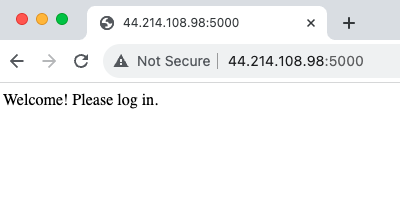
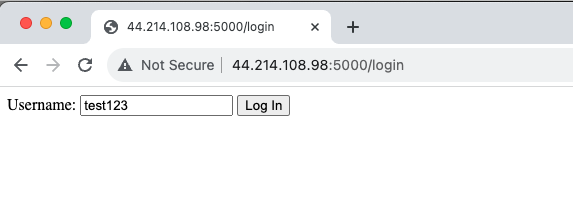
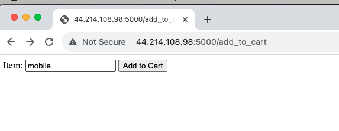
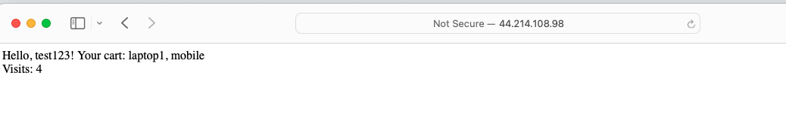
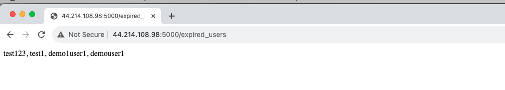

# Flask Redis Session Management

This is a simple Flask web application that demonstrates user session management using Redis as the session storage. It allows users to log in, manage a shopping cart, and tracks their visits. The application is designed to showcase how to handle user sessions, maintain user data, and implement secure session management.

## Prerequisites

Before running the application, ensure you have the following prerequisites installed:

- [Python](https://www.python.org/) (version 3.6 or later)
- [Flask](https://flask.palletsprojects.com/en/2.0.x/)
- [Redis](https://redis.io/) or [Redis Cluster](https://redis.io/topics/cluster)
- [redis-py](https://pypi.org/project/redis/)
- [uuid](https://docs.python.org/3/library/uuid.html) (standard Python library)

## Installation and Usage

1. Clone the repository:

```bash
git clone https://github.com/aws-samples/amazon-elasticache-samples.git
cd webinars/flask-redis-session
```

2. Install the requirements 
```bash
pip install requirements.txt
```

3. Set the application variable 
```bash
export FLASK_APP=sessionstore.py 
export SECRET_KEY=test 
export REDIS_URL=test1.XXXXXX.clustercfg.use1.cache.amazonaws.com
```

4.  Installation and Usage
```bash  
flask run -h 0.0.0.0 -p 5000 --reload
```

## Features
### User login and session management.
Access  application using browser 



#### Login to the application with /login


#### Shopping cart management for logged-in users.
Add itemns to cart


#### Visits count for each user.
Reload the browser to see updated visits count 

#### Secure session token generation and management.

#### Access from a differrent browser with same userid to see the   session data retrieved and count updated 


#### Displays expired user sessions.

For all logged out users keep track of with with /expired_users 

